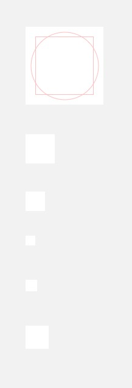
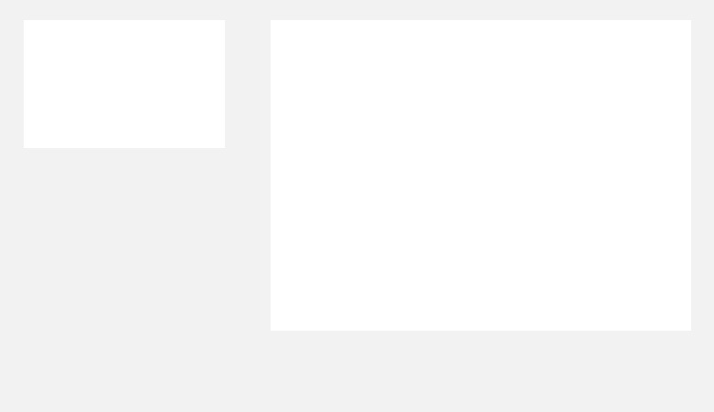
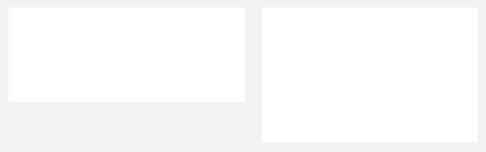

# Sketch Icon Template for Chrome Webstore Apps and Extensions
For usage ;) As a way of doing a little something back for the community.

**Includes:**
 - Chrome Extension Toolbar Button 19x19
 - Chrome Extension Toolbar Button 38x38
 - Fav Icon 16x16
 - Fav Icon 32x32
 - Extension Management App Icon 48x48
 - App Icon 128x128
 - Promotional Image Small 440x280
 - Promotional Image Large 920x680
 - Promotional Image Marquee 1400x560
 - Screenshot 1280x800

*Artboards include guides and references!*

**For extra information:**
 - https://developer.chrome.com/extensions/browserAction
 - https://developer.chrome.com/apps/manifest/icons
 - https://developer.chrome.com/webstore/images#icons

 Icon Template for Chrome Webstore Apps and Extensions van <a xmlns:cc="http://creativecommons.org/ns#" href="http://dhesign.com" property="cc:attributionName" rel="cc:attributionURL">Dimitrie Hoekstra</a> is in licentie gegeven volgens een <a rel="license" href="http://creativecommons.org/licenses/by-sa/4.0/">Creative Commons Naamsvermelding-GelijkDelen 4.0 Internationaal-licentie</a>. Original work can be found on <a xmlns:dct="http://purl.org/dc/terms/" href="https://github.com/strages/Macbook-2015-Vector" rel="dct:source">https://github.com/strages/Icon-Template-Chrome-Webstore-Apps-and-Extensions</a>.